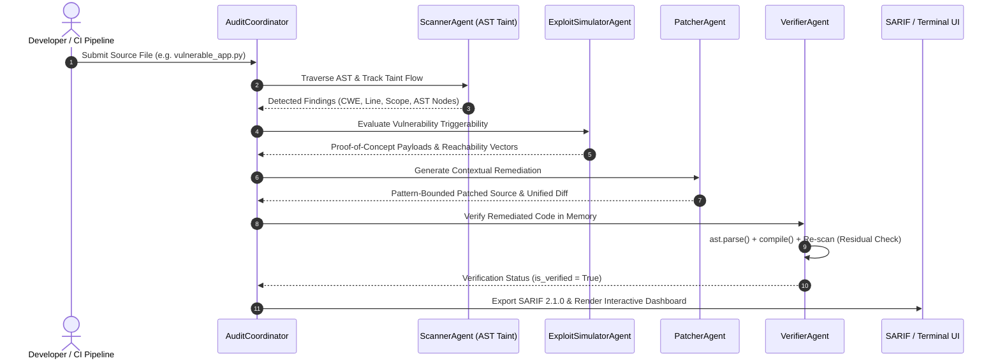

# 🛡️ Agentic Code Security Sentinel & Autonomous Remediation Engine

[](https://python.org)
[](src/agents)
[](https://cwe.mitre.org)
[](https://docs.oasis-open.org/sarif/sarif/v2.1.0/sarif-v2.1.0.html)
[](tests/run_self_audit.py)
[](LICENSE)

An autonomous DevSecOps static analysis and remediation system powered by Python Abstract Syntax Tree (AST) analysis, source-to-sink taint tracking, Shannon information entropy secrets detection, and a multi-agent consensus pipeline.

Provides end-to-end vulnerability discovery, categorized exploit simulation payloads, pattern-bounded remediation synthesis, AST compilation verification, and OASIS SARIF 2.1.0 export.

---

## 🏛️ Multi-Agent Architecture

The sentinel coordinates five specialized agents across a deterministic pipeline to avoid false positives and guarantee syntactically valid patches:



### 🤖 Specialized Agent Roles

1. **ScannerAgent (AST Taint & Entropy Engine)**:
   - Traverses the AST with custom `NodeVisitor` handlers.
   - Traces variable taint across function parameters and assignment chains to identify unsafe sinks (`eval`, `pickle.loads`, `os.system`, parameterized SQL bypasses, path operations).
   - Computes Shannon entropy on string literals to detect hardcoded secrets ($H > 4.0$ bits).

2. **ExploitSimulatorAgent (Vector & PoC Synthesis)**:
   - Evaluates whether flagged sources reach sinks without sanitization guards (`os.path.commonpath`, parameterized tuples).
   - Constructs safe demonstration Proof-of-Concept (PoC) exploit payloads for security teams.

3. **PatcherAgent (Remediation Synthesizer)**:
   - Generates line-bounded, contextual security replacements (e.g., parameterizing SQL queries, converting shell command strings into `subprocess.run(..., shell=False)` argument vectors, securing path bounds).
   - Produces standard unified diffs for code review.

4. **VerifierAgent (In-Memory Compilation & Regression Guard)**:
   - Compiles patched code in-memory via `ast.parse` and Python bytecode `compile()`.
   - Re-scans the patched code with the `ScannerAgent` to verify that findings belonging to the target ruleset drop to zero (`residual_count == 0`).

5. **AuditCoordinator (Pipeline Orchestration)**:
   - Drives agent consensus, records execution metrics, formats results, and exports GitHub CodeQL-compatible **SARIF 2.1.0** reports.

---

## 📊 Supported Vulnerability Matrix (OWASP & MITRE CWE)

| CWE ID | Vulnerability Category | Default Severity | CVSS v3.1 | Remediation Strategy |
| :--- | :--- | :--- | :--- | :--- |
| **CWE-89** | SQL Injection (String Concatenation / Formats) | `CRITICAL` | **9.8** | Parameterized query tuple replacement |
| **CWE-78** | OS Command Injection (`shell=True`, `os.system`) | `CRITICAL` | **9.8** | Safe argument array `subprocess.run(..., shell=False)` |
| **CWE-22** | Path Traversal / Arbitrary File Access | `HIGH` | **8.6** | Base directory containment check via `abspath` / `commonpath` |
| **CWE-502** | Insecure Deserialization (`pickle.loads`) | `CRITICAL` | **9.8** | Safe structured serialization (`json.loads`) |
| **CWE-798** | Hardcoded Secrets & Cryptographic Keys | `HIGH` | **7.5** | Environment variable externalization (`os.environ.get`) |
| **CWE-327** | Broken Cryptographic Hashes (MD5 / SHA-1) | `MEDIUM` | **5.9** | Cryptographic hash upgrade (`hashlib.sha256`) |
| **CWE-94** | Arbitrary Code Execution (`eval`, `exec`) | `CRITICAL` | **9.8** | Safe literal evaluation (`ast.literal_eval`) |

---

## 🧮 Algorithmic & Mathematical Core

### 1. Shannon Information Entropy (Secrets Detection)
Measures the information density of string literals to isolate high-entropy tokens from natural language strings:
$$H(X) = -\sum_{i=1}^{n} p(c_i) \log_2 p(c_i)$$
- **Natural language / identifiers**: $H < 3.0$ bits
- **Pseudorandom tokens / API secrets**: $H > 4.0$ bits

### 2. FIRST CVSS v3.1 Quantitative Scoring
Calculates standard vulnerability base metrics:
$$ISS = 1 - \left[(1 - C) \times (1 - I) \times (1 - A)\right]$$
$$Impact = \begin{cases} 6.42 \times ISS & \text{Scope Unchanged} \\ 7.52 \times (ISS - 0.029) - 3.25 \times (ISS - 0.02)^{15} & \text{Scope Changed} \end{cases}$$
$$BaseScore = \min\left(10, \, \text{RoundUp}(Impact + Exploitability)\right)$$

---

## 🧪 Verification & Audit

| Verification Suite | Test Scope | Result | Status |
| :--- | :--- | :--- | :--- |
| **Pytest Unit Suite** | AST traversal, CWE visitors, agents, SARIF formatting | **13/13 Passed** | ✅ Verified |
| **Independent Self-Audit** | 8 automated checks (AST, False Positive control, Entropy, Patcher, Verifier, SARIF) | **8/8 Passed** | ✅ Verified |
| **Compilation Safety** | In-memory `ast.parse` and bytecode `compile()` on all generated patches | Zero syntax errors | ✅ Verified |
| **Residual Flaw Check** | Re-scan of patched codebase within target ruleset | 0 residual flaws | ✅ Verified |

---

## 💻 Tech Stack

- **Core Runtime**: Python 3.11+
- **Parsing & AST**: Python `ast`, `token`, `tokenize`
- **Specification Standards**: OASIS SARIF 2.1.0, MITRE CWE, OWASP Top 10
- **Testing**: Pytest, Custom Self-Audit Engine (`tests/run_self_audit.py`)
- **Dashboard & Visualization**: Streamlit, Custom Institutional CSS

---

## 🚀 Quickstart

### Installation
```bash
git clone https://github.com/emirhankaya-AFK/agentic-code-security-sentinel.git
cd agentic-code-security-sentinel

python -m venv .venv
source .venv/bin/activate  # Windows: .venv\Scripts\activate

pip install -r requirements.txt
```

### Run Tests & Verification
```bash
# Execute unit tests
pytest tests/ -v

# Run the 8-step self-audit suite
python tests/run_self_audit.py
```

### Run Full Security Audit on Sample Code
```bash
python -c "
from src.agents.coordinator import AuditCoordinator
coordinator = AuditCoordinator()
report = coordinator.run_pipeline('samples/vulnerable_app.py')
print(report.to_markdown())
"
```

### Launch Interactive Terminal
```bash
streamlit run dashboard/app.py
```

---

## ⚠️ Scope & Operational Notice

- Automated patches are generated via deterministic, pattern-bounded AST code transformation designed to remediate common CWE patterns without hallucination.
- In production environments, automatically generated patches should undergo peer review and behavioral integration testing prior to merging.

---

## 📄 License

Distributed under the MIT License. See `LICENSE` for details.
