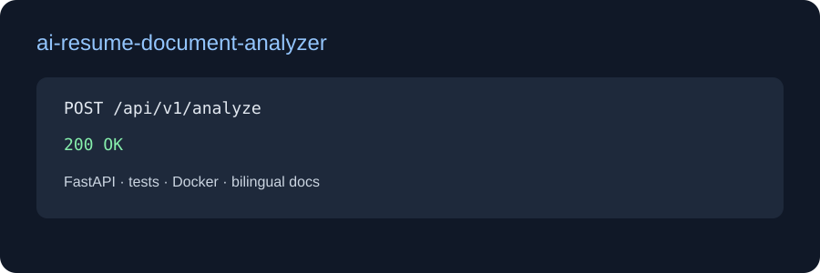

# AI Resume / Document Analyzer

[English](README.md) | [Türkçe](README_TR.md) | [Deutsch](README_DE.md)

FastAPI document intelligence MVP for CV and PDF text. It returns a concise summary, detected skills, experience years, a grounded answer and source filename.

## Stack
Python, FastAPI, Pydantic, deterministic extraction, Docker, pytest and GitHub Actions. The current vertical slice accepts extracted text; a production adapter can add PDF/DOCX parsers, OCR, embeddings/RAG, PostgreSQL and an LLM provider.

## API and run
POST /api/v1/analyze accepts filename, text and optional question. Only PDF, TXT and DOCX filenames are accepted.

    pip install -e ".[dev]"
    uvicorn app.main:app --reload
    pytest -q

Docker: docker compose up --build. Interactive API docs: /docs.

The answer is deliberately grounded in submitted text and is not a hiring decision.
