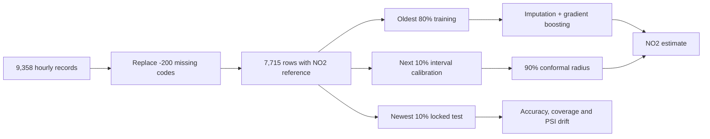
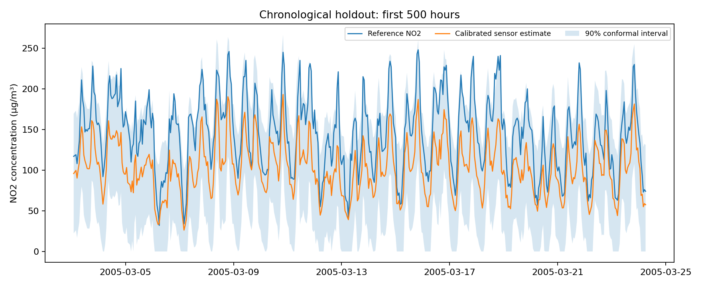

# Drift-Aware Air Quality Sensor Calibration

[](https://github.com/emirhankaya-AFK/air-quality-sensor-calibration/actions/workflows/ci.yml)

Calibration of low-cost metal-oxide gas sensors against certified NO2 reference measurements using
the real-world [UCI Air Quality dataset](https://archive.ics.uci.edu/dataset/360/air%2Bquality).
The study emphasizes temporal validation, sensor drift, missing measurements and uncertainty rather
than presenting a randomly shuffled score that would overstate field performance.

## Evaluation design



Only five sensor responses, temperature, relative/absolute humidity and cyclical time features are
used. Other certified pollutant reference columns are deliberately excluded to avoid a misleading
calibration task.

## Chronological holdout results

The final test period contains 772 hourly observations.

| Metric | Calibrated model | Training-median baseline |
| --- | ---: | ---: |
| MAE (µg/m³) | **39.56** | 44.97 |
| RMSE (µg/m³) | **44.32** | 55.95 |
| R² | **0.049** | -0.516 |

The nominal 90% split-conformal interval covers **96.0%** of the later observations with a ±73.58
µg/m³ radius. The wide interval and low R² are important findings: the model beats the baseline, but
long-term field drift makes point estimates weak. Population Stability Index identifies major shifts
in humidity, temperature and the NO2-sensitive sensor response.



## Reproduce

```bash
python -m pip install -e ".[dev]"
python scripts/download_data.py
python scripts/train.py
python -m pytest -q
python -m ruff check .
```

`data/manifest.json` records the source archive checksum. Versioned artifacts include full metrics,
PSI drift values, holdout predictions and the result chart. Raw UCI files and the trained model bundle
are excluded from Git.

## Limitations

- Data comes from one device in one Italian city during 2004–2005.
- Sensor names are provided, but deployment-specific calibration metadata is limited.
- The large seasonal shift violates the stationarity assumption behind simple calibration.
- This model is unsuitable for regulatory or health decisions without contemporary co-location data.

See [MODEL_CARD.md](MODEL_CARD.md) for the intended use and risk boundary.

## Data citation

De Vito, S., Massera, E., Piga, M., Martinotto, L., & Di Francia, G. (2008). Air Quality [Dataset].
UCI Machine Learning Repository. https://doi.org/10.24432/C59K5F

Code is available under the [MIT License](LICENSE). Dataset rights remain with the original source.

