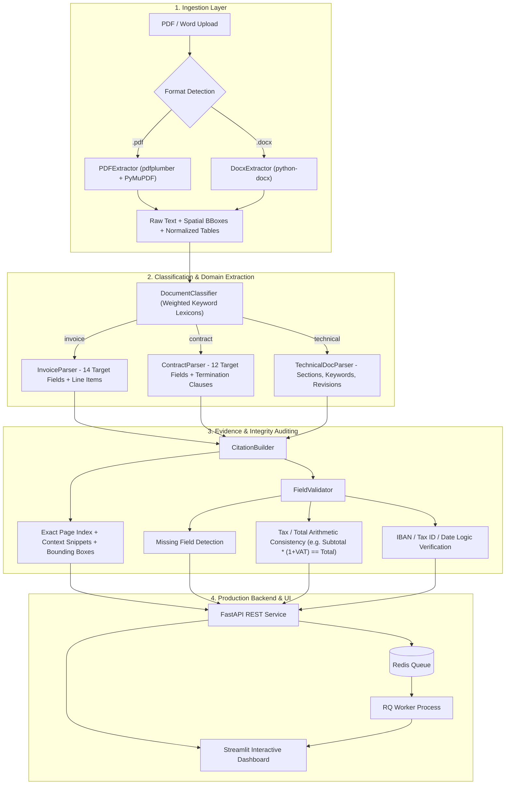

# 📄 Document Intelligence & Evidence Extraction Pipeline

[](https://github.com/emirhankaya-AFK/document-intelligence-pipeline/actions)
[](https://python.org)
[](https://fastapi.tiangolo.com)
[](https://streamlit.io)
[](https://python-rq.org)
[](tests/)
[](tests/evaluation)
[](LICENSE)

An enterprise document intelligence and structured data extraction engine tailored for complex Turkish business documents: **Invoices, Legal Contracts, and Technical Specifications**.

Converts unstructured PDF and Word documents into validated JSON schemas with page-level citations, text context snippets, and bounding box coordinates, backed by an asynchronous distributed queue and institutional dashboard.

---

## 🏗️ Architecture & Pipeline Flow



---

## 🎯 Key Capabilities & Domain Coverage

### 1. Document Classification
- **Domain Lexicon Scoring**: Employs domain-specific Turkish lexicons to compute confidence scores across `invoice`, `contract`, and `technical` types.
- **Uncertainty Guard**: Flags ambiguous documents when confidence falls below the acceptance threshold ($< 0.60$).

### 2. Specialized Domain Extraction
- **Invoices (`invoice`)**:
  - `fatura_no`, `tarih`, `vade_tarihi`, `satici_adi`, `satici_vkn` (10-digit Tax ID), `alici_adi`, `alici_vkn`, `ara_toplam`, `kdv_orani`, `kdv_tutari`, `toplam_tutar`, `para_birimi` (TRY, USD, EUR), `iban` (TR format), `odeme_kosullari`.
  - **Structured Line Items**: Auto-detects table columns (description, quantity, unit price, line total).
- **Contracts (`contract`)**:
  - `sozlesme_no`, `sozlesme_turu` (Service, Employment, NDA, Supply), `taraflar` (Employer, Contractor, Parties), `baslangic_tarihi`, `bitis_tarihi`, `sure`, `odeme_kosullari`, `fesih_sartlari` (multi-clause termination conditions), `ceza_klozu`, `gizlilik_maddesi`, `imza_tarihi`, `imzalayanlar`.
- **Technical Specifications (`technical`)**:
  - `baslik`, `versiyon`, `yazar`, `tarih`, `kurulus`, `bolumler` (multi-level hierarchical heading outline), `anahtar_kelimeler`, `ozet`, `revizyon_gecmisi`.

### 3. Traceable Evidence & Citations
- Every extracted field is paired with:
  - Exact target page number.
  - Character snippet showing surrounding text context.
  - Spatial bounding box coordinate `[x0, y0, x1, y1]` for highlight rendering.
  - Extraction confidence metric.

### 4. Semantic & Arithmetic Validation
- **Mathematical Integrity**: Validates $\text{Subtotal} + \text{VAT} = \text{Grand Total}$ with tolerance limits.
- **Format Integrity**: Verifies 10-digit Turkish Tax ID (VKN), TR-formatted IBAN (TR + 24 digits), and alphanumeric serials.
- **Temporal Integrity**: Checks that contract termination dates do not precede initiation dates.

---

## 📊 Benchmarks & Empirical Evaluation

The extraction pipeline is evaluated against a ground-truth dataset (`tests/evaluation/ground_truth.json`) of synthetic, multi-style Turkish documents.

```bash
python tests/evaluation/run_evaluation.py
```

| Document Class | Precision | Recall | F1 Score | Test Set Status |
| :--- | :--- | :--- | :--- | :--- |
| **Invoices** | **1.00** | 0.75 | **0.86** | 3 documents (Standard, USD, Incomplete) |
| **Contracts** | **1.00** | 0.86 | **0.92** | 2 documents (Service Agreement, NDA) |
| **Technical Docs** | **1.00** | 1.00 | **1.00** | 2 documents (API Spec, Deployment Guide) |
| **Overall Micro-Average** | **1.00** | **0.84** | **0.91** | **7 Documents / 48 Evaluated Fields** |

- **Classification Accuracy**: **100.0% (7/7)**
- **Unit Test Suite**: **68 / 68 Passed** (FastAPI endpoints, classifiers, extractors, parsers, e2e pipeline)
- **Code Quality**: Zero `ruff` lint errors

---

## 💻 Tech Stack

- **Extraction**: `pdfplumber`, `PyMuPDF` (`fitz`), `python-docx`
- **Backend API**: `FastAPI`, `Uvicorn`, `Pydantic v2`
- **Distributed Queue**: `Redis 7`, `RQ` (Redis Queue)
- **Dashboard**: `Streamlit`, `Pandas`, Custom Institutional CSS
- **Document Generation**: `ReportLab` (synthetic reproducible evaluation set)
- **Containerization**: Docker, Docker Compose
- **CI/CD**: GitHub Actions (Lint, Pytest, Accuracy Evaluation, Docker build)

---

## 🚀 Quickstart

### Option 1: Docker Compose (Recommended)
Spins up Redis, FastAPI, RQ Worker, and the Streamlit Dashboard simultaneously:
```bash
git clone https://github.com/emirhankaya-AFK/document-intelligence-pipeline.git
cd document-intelligence-pipeline

docker-compose up --build
```
- Dashboard: [http://localhost:8501](http://localhost:8501)
- Interactive API Docs (Swagger): [http://localhost:8000/docs](http://localhost:8000/docs)

### Option 2: Local Installation
```bash
# Clone and setup environment
git clone https://github.com/emirhankaya-AFK/document-intelligence-pipeline.git
cd document-intelligence-pipeline

python -m venv .venv
source .venv/bin/activate  # Windows: .venv\Scripts\activate

pip install -r requirements.txt

# Generate evaluation PDFs
python samples/create_samples.py
```

#### Run Tests & Evaluation
```bash
# Execute unit test suite
pytest tests/ -v --ignore=tests/evaluation

# Execute accuracy benchmark against ground truth
python tests/evaluation/run_evaluation.py
```

#### Launch Services
```bash
# Terminal 1: FastAPI Service (Sync fallback active if Redis is offline)
uvicorn api.main:app --host 0.0.0.0 --port 8000

# Terminal 2: Streamlit Dashboard
streamlit run dashboard/app.py --server.port 8501
```

---

## 📡 REST API Reference

```bash
# Upload document for asynchronous processing
curl -X POST http://localhost:8000/api/v1/upload \
  -F "file=@samples/invoices/sample_invoice_1.pdf"
# -> {"job_id": "8b9e...", "status": "queued"}

# Query job status
curl http://localhost:8000/api/v1/status/8b9e...

# Fetch complete extracted payload & citations
curl http://localhost:8000/api/v1/result/8b9e...

# Fetch compact field dictionary only
curl http://localhost:8000/api/v1/result/8b9e.../fields
```

---

## 📄 License

Distributed under the MIT License. See `LICENSE` for details.
