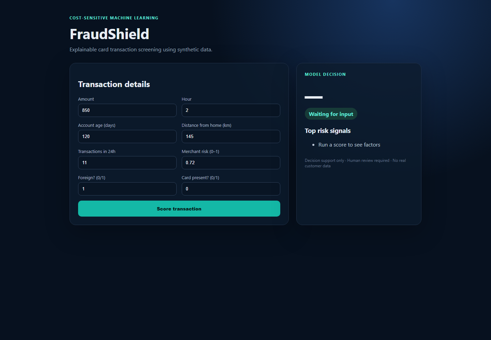
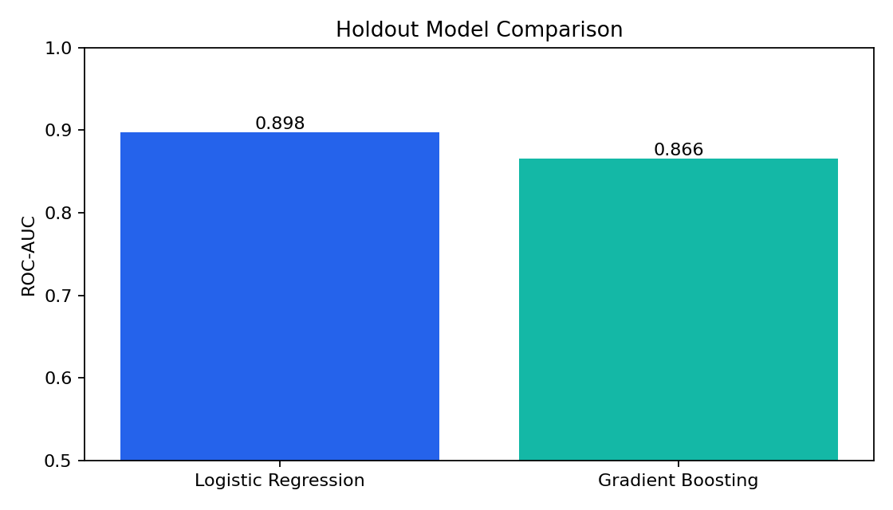
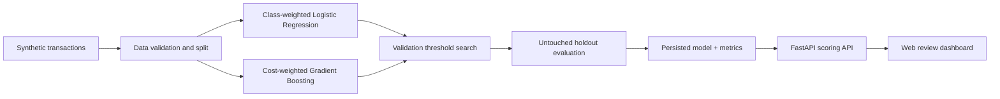

# Fraud Detection ML Pipeline

[](https://github.com/emirhankaya-AFK/fraud-detection-ml-pipeline/actions/workflows/ci.yml)
[](https://www.python.org/)
[](LICENSE)

An end-to-end, cost-sensitive machine-learning system for screening card transactions. It handles severe class imbalance, compares two models, selects a decision threshold from business costs, and exposes predictions through an explainable API and web dashboard.

> **Privacy:** This project uses reproducible synthetic data only. No real customer, card, account, or personally identifiable data is included.



## What I built

- A reproducible synthetic transaction generator with a realistic 1.2% fraud rate.
- A leakage-safe train/validation/test workflow.
- Class-weighted Logistic Regression and cost-weighted Gradient Boosting baselines.
- Validation-only threshold optimization where a missed fraud costs 50× more than a false alert.
- A FastAPI scoring service with validated inputs and human-readable risk signals.
- A responsive browser dashboard, automated tests, CI, and one-command Docker startup.

## Results

Results below are from the untouched 3,000-row holdout set (`seed=42`). They describe this synthetic benchmark, not production banking performance.

| Model | ROC-AUC | PR-AUC | Precision | Recall | F1 | Threshold | Estimated cost |
|---|---:|---:|---:|---:|---:|---:|---:|
| **Class-weighted Logistic Regression** | **0.898** | **0.357** | 0.054 | **0.750** | 0.100 | 0.485 | **4,630** |
| Cost-weighted Gradient Boosting | 0.866 | 0.218 | **0.350** | 0.389 | **0.368** | 0.805 | 5,630 |

The selected model caught 27 of 36 fraudulent transactions and missed 9. Its low precision is an intentional consequence of the assumed asymmetric cost: **5 units per false positive versus 250 per false negative**. In a real bank, these values should come from investigation capacity, chargeback losses, customer friction, and regulatory requirements.



## Architecture



## Tech stack

Python 3.11 · pandas · NumPy · scikit-learn · FastAPI · Pydantic · Matplotlib · Docker Compose · pytest · Ruff · GitHub Actions

## Run with Docker

```bash
docker compose up --build
```

Open [http://localhost:8000](http://localhost:8000) for the dashboard or [http://localhost:8000/docs](http://localhost:8000/docs) for interactive API documentation.

## Run locally

```bash
python -m venv .venv
# Windows: .venv\Scripts\activate
# macOS/Linux: source .venv/bin/activate
pip install -r requirements-dev.txt
python -m src.train
pytest -q
uvicorn src.api:app --reload
```

Example request:

```bash
curl -X POST http://localhost:8000/predict \
  -H "Content-Type: application/json" \
  -d '{"amount":850,"hour":2,"account_age_days":120,"distance_from_home_km":145,"transactions_last_24h":11,"merchant_risk_score":0.72,"is_foreign":1,"is_card_present":0}'
```

## Repository structure

```text
.
├── src/
│   ├── data.py          # Synthetic data generator
│   ├── train.py         # Training, evaluation, threshold optimization
│   ├── api.py           # Prediction API
│   └── dashboard.html   # Review interface
├── tests/               # Data, cost logic, and API tests
├── artifacts/           # Reproducible metrics and charts
├── .github/workflows/   # CI pipeline
├── Dockerfile
└── compose.yaml
```

## API response

Every score returns the fraud probability, the cost-optimized decision, the threshold, and the three strongest human-readable risk signals. The explanation is intentionally presented as a review aid—not as a causal claim or an automatic customer decision.

## Limitations and next steps

- Synthetic patterns are simpler than adversarial, time-dependent real-world fraud.
- Risk signals are transparent heuristic contributions, not causal explanations.
- The benchmark does not model concept drift, delayed labels, or merchant/customer histories.
- A production system would add temporal validation, calibrated probabilities, drift monitoring, bias testing, access control, audit logs, and a human appeal workflow.
- SMOTE was deliberately not used: synthetic interpolation can blur rare fraud modes. Class/sample weighting preserves original observations while directly optimizing the asymmetric objective.

## Responsible use

This is an educational portfolio project. It must not be used as the sole basis for blocking a payment or taking adverse action against a customer. Production use requires validated data, governance, monitoring, security controls, and human oversight.

## License

[MIT](LICENSE)
