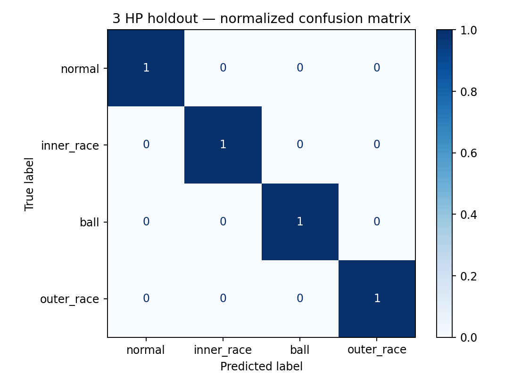

# Motor Bearing Fault Diagnosis

A reproducible bearing-condition classification study using the official Case Western Reserve University 12 kHz drive-end vibration recordings.

The useful question is not whether a model can recognize shuffled windows from a recording it already saw. This project asks whether it can recognize the same bearing condition at a motor load held out from training.

## Study design

Four conditions are included at 0, 1, 2 and 3 HP:

- normal bearing
- 0.007-inch inner-race fault
- 0.007-inch ball fault
- 0.007-inch outer-race fault at the 6 o'clock position

Each source recording is split into non-overlapping 2,048-sample windows. The classical benchmark uses leave-one-motor-load-out evaluation. Windows from one source file therefore never appear in both training and test data within a fold.

## Models and signals

The engineered-feature baseline combines:

- RMS, kurtosis, skewness and crest/impulse/shape factors
- Hann-windowed FFT band energy, spectral centroid and entropy
- four-level Daubechies-4 wavelet energy
- an Extra Trees classifier with class balancing

A separate fixed 1D-CNN baseline trains on 0–1 HP, selects its epoch on 2 HP and evaluates once on 3 HP. This keeps the final load condition outside model selection.

## Reproduce

```bash
python -m venv .venv
source .venv/bin/activate  # Windows: .venv\Scripts\activate
pip install -e ".[dev,cnn]"
python scripts/download_data.py
ruff check .
pytest -q
python scripts/train_classical.py
python scripts/train_cnn.py
```

The downloader fetches 16 `.mat` files directly from the [CWRU Bearing Data Center](https://engineering.case.edu/bearingdatacenter/download-data-file). Raw files and trained weights are deliberately not committed.

## Reported evidence

Generated outputs live in `artifacts/`:

- per-load accuracy, macro-F1 and class-level metrics
- normalized confusion matrix for the 3 HP holdout
- feature importance for the classical baseline
- expected calibration error, multiclass Brier score and worst-class recall
- additive Gaussian-noise stress test from 20 dB down to 0 dB SNR
- time/FFT/wavelet feature-family ablation on the 3 HP holdout
- CNN validation and untouched 3 HP test metrics
- SHA-256 checksums for downloaded source files

Metrics are regenerated from the code rather than written into this README by hand.

## Current result

The reproducible run on 1,537 non-overlapping windows produced:

| Evaluation | Macro-F1 |
| --- | ---: |
| Extra Trees, mean of four leave-one-load-out folds | 1.000 |
| 1D-CNN, untouched 3 HP test after 2 HP validation | 1.000 |



The perfect score should be read as evidence that these four controlled CWRU conditions are highly separable, not that the models have solved industrial bearing diagnosis. The source files, splits and class-level reports are recorded in `artifacts/classical_metrics.json` and `artifacts/cnn_metrics.json` so the result can be audited.

The clean 3 HP holdout remains perfect at 5–20 dB added-noise tests, but falls to **0.7049 macro-F1 at 0 dB SNR**. This failure boundary is more informative than the clean score alone. Feature-family ablation and noise results are stored in `artifacts/ablation_metrics.json` and `artifacts/classical_metrics.json`.

## Single-file inference

After training the classical model, a CWRU-style MATLAB file can be checked with:

```bash
python scripts/predict_mat.py data/raw/108.mat
```

The command aggregates window probabilities and prints a warning that confidence is specific to the CWRU training domain.

## Limits

CWRU faults are deliberately seeded by electrical-discharge machining on a laboratory rig. Strong results do not establish performance on naturally developing faults, other sensors, other machines or noisy industrial installations. This repository is a condition-monitoring study, not a deployable safety system.

## License

Code is MIT licensed. The dataset remains subject to the terms of its original publisher.
