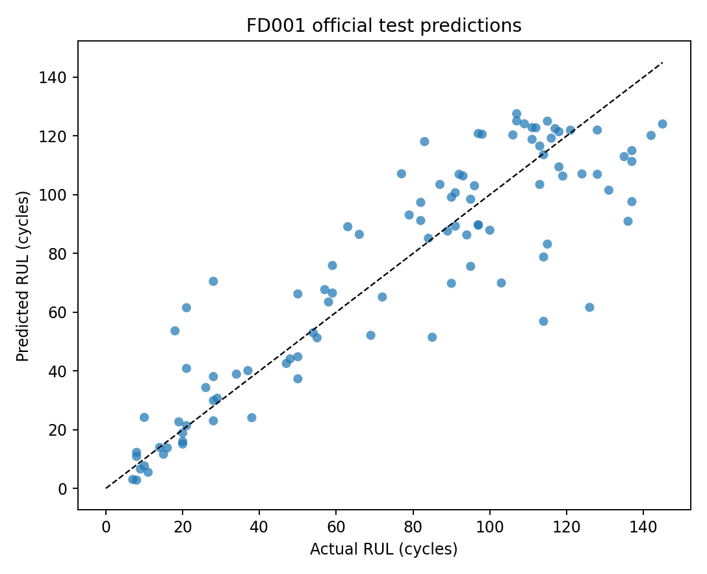

# NASA Turbofan Remaining Useful Life

A reproducible remaining-useful-life study on NASA's C-MAPSS FD001 turbofan trajectories.

The objective is to predict how many operating cycles remain before failure. Training trajectories run to failure; official test trajectories stop earlier and NASA supplies their hidden future lifetime as a separate target file.

## Experimental design

- 100 training engines and 100 official test engines
- 3 operating settings and 21 sensor channels per cycle
- piecewise-linear training target capped at 125 cycles
- constant or near-constant sensors removed from the model inputs
- causal 5- and 10-cycle rolling mean, standard deviation and trend features
- complete engine identities separated during validation
- official test evaluation uses only the final observed cycle of each engine

Randomly splitting rows would leak adjacent cycles from the same engine into validation. This repository uses `GroupShuffleSplit` by engine ID instead.

## Models

1. Median RUL baseline
2. Histogram Gradient Boosting on current and causal rolling features
3. GRU sequence baseline using the last 30 cycles

The classical model also reports a split-conformal 90% prediction interval derived only from held-out validation engines.

## Current results

| Model | Official test MAE | Official test RMSE |
| --- | ---: | ---: |
| Median RUL baseline | 35.90 | 42.86 |
| Histogram Gradient Boosting | 13.90 | 18.90 |
| 30-cycle GRU | 11.15 | 15.19 |

The classical model's nominal 90% conformal interval covered **86%** of official test targets. That shortfall is reported rather than silently calling the interval calibrated. Full reports are stored in `artifacts/classical_metrics.json` and `artifacts/gru_metrics.json`.



## Metrics

- mean absolute error (MAE)
- root mean squared error (RMSE)
- PHM08/NASA asymmetric score, which penalizes late maintenance predictions more heavily
- late-prediction rate
- empirical coverage of the 90% prediction interval

## Reproduce

```bash
python -m venv .venv
source .venv/bin/activate  # Windows: .venv\Scripts\activate
pip install -e ".[dev,sequence]"
python scripts/download_data.py
ruff check .
pytest -q
python scripts/train_classical.py
python scripts/train_gru.py
```

Data is downloaded from the official [NASA C-MAPSS Open Data page](https://data.nasa.gov/dataset/cmapss-jet-engine-simulated-data). The archive is not committed; its SHA-256 digest and extracted file list are stored in `data/manifest.json`.

## Boundaries

C-MAPSS is a high-fidelity simulation, not flight-recorder data from operational aircraft. FD001 contains one operating condition and one fault mode. The results measure performance on this benchmark and do not validate maintenance decisions, flight safety, other engines, multiple fault modes or changing environmental conditions.

## License

Project code is MIT licensed. The dataset remains subject to its original publisher's terms; NASA's catalog currently does not specify a dataset license.
