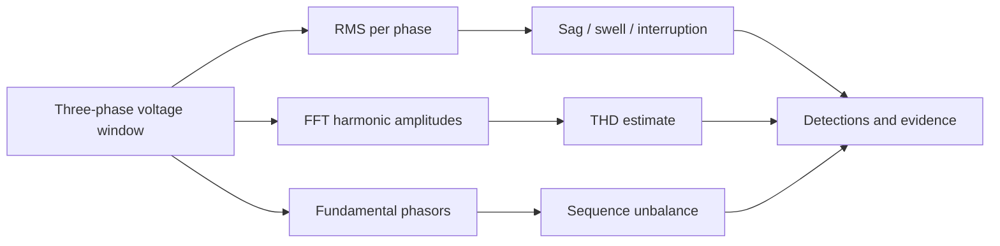

# Power Quality Disturbance Analyzer

[](https://github.com/emirhankaya-AFK/power-quality-disturbance-analyzer/actions/workflows/ci.yml)

An educational, reproducible three-phase waveform analysis platform that detects voltage sag, swell, interruption, harmonic distortion, and phase unbalance.

> **Scope:** This repository uses seeded synthetic signals and configurable demonstration thresholds. It is not a calibrated instrument, a field-data study, or an IEC/IEEE compliance claim.

## What it demonstrates

- Per-phase RMS voltage and per-unit magnitude
- FFT-based THD estimate from harmonics 2–10
- Fundamental-frequency phasor extraction
- Voltage unbalance using negative/positive sequence ratio
- Multi-label evidence and deterministic primary classification
- FastAPI endpoints and an interactive Plotly dashboard
- Seeded benchmark, automated tests, Docker, and GitHub Actions

## Pipeline



## Demonstration thresholds

| Event | Rule |
| --- | --- |
| Interruption | minimum phase RMS `< 0.10 pu` |
| Voltage sag | minimum phase RMS `< 0.90 pu` |
| Voltage swell | maximum phase RMS `> 1.10 pu` |
| Harmonic distortion | maximum phase THD `> 5%` |
| Phase unbalance | negative/positive sequence ratio `> 2%` |

## Quick start

```bash
python -m venv .venv
source .venv/bin/activate  # Windows: .venv\Scripts\activate
pip install -e ".[dev]"
ruff check .
pytest -q
python tests/benchmark.py
uvicorn api.main:app --reload
```

Open `http://127.0.0.1:8000` for the dashboard or `/docs` for the API.

Useful routes:

- `GET /demo/nominal`
- `GET /demo/voltage_sag`
- `GET /demo/harmonic_distortion`
- `GET /demo/phase_unbalance/waveform`
- `POST /analyze` with equal-length three-phase sample arrays

## Verification

CI runs Ruff, pytest, the complete seeded synthetic benchmark, and a Docker image build. The benchmark contains 300 generated examples across six classes. Its result measures only this known synthetic generator and must not be interpreted as field accuracy.

## Limitations

- Stationary synthetic windows do not reproduce a complete sensor chain, transducer saturation, switching transients, or real-grid diversity.
- Thresholds require calibration before hardware or operational use.
- The analyzer classifies a complete window and does not localize event boundaries.
- No standards certification or production-monitoring claim is made.

## License

MIT
