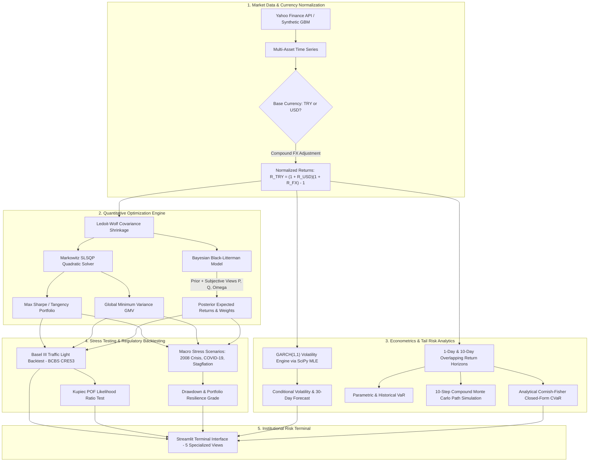

# 🏛️ Institutional Quantitative Portfolio Optimization & Risk Engine

[](https://python.org)
[](https://streamlit.io)
[](https://plotly.com)
[](https://pytest.org)
[](tests/run_math_audit.py)
[](LICENSE)

An institutional-grade quantitative finance platform implementing modern portfolio theory, Bayesian asset allocation, volatility clustering models, closed-form extreme risk estimation, and regulatory backtesting.

Designed with an **Institutional Risk Terminal UI** that blends Bloomberg-terminal density with modern web ergonomics.

---

## 🏗️ Architecture & Data Pipeline



---

## 🎯 Key Methodologies & Mathematical Foundations

### 1. Multi-Currency Normalization & Real Market Ingestion
- Supports 8 institutional asset classes: **BIST 100 (TRY), S&P 500 (USD), BIST Bank (TRY), US 10Y Treasury (USD), Gold Spot (USD), Brent Crude (USD), USD/TRY (FX), Bitcoin (USD)**.
- Full base currency parity: Converts USD returns to TRY or vice-versa using exact compounding:
  $$R_{TRY} = (1 + R_{USD})(1 + R_{FX}) - 1$$
- Eliminates currency misalignment errors present in standard open-source portfolio demos.

### 2. Robust Portfolio Optimization (SLSQP & Ledoit-Wolf)
- **High-Dimensional Covariance Estimation**: Computes Ledoit-Wolf analytical shrinkage covariance $\Sigma_{LW} = \delta F + (1 - \delta) S$, guaranteeing well-conditioned, positive semi-definite matrices even in volatile regimes.
- **Sequential Least Squares Programming (SLSQP)**: Solves constrained optimization for Maximum Sharpe (Tangency) and Global Minimum Variance (GMV) with analytical gradient bounds.
- **Monte Carlo Efficient Frontier**: 4,000 Dirichlet-distributed portfolios to visually evaluate feasible risk-return profiles.

### 3. Bayesian Black-Litterman Allocation
- Derives market-implied equilibrium returns via reverse CAPM optimization:
  $$\Pi = \lambda \Sigma w_{mkt}$$
- Updates equilibrium returns with investor subjective views (both absolute and relative) using Bayesian blending:
  $$E[R] = [(\tau\Sigma)^{-1} + P^T \Omega^{-1} P]^{-1} [(\tau\Sigma)^{-1} \Pi + P^T \Omega^{-1} Q]$$

### 4. Advanced Tail Risk & GARCH(1,1) Volatility
- **Closed-Form Cornish-Fisher Expected Shortfall (CVaR)**: Eliminates heuristic approximations by analytically integrating the Cornish-Fisher polynomial quantile function under standard Gaussian measure ($\approx 10^{-16}$ precision).
- **Exact Multi-Day Compounding**: Multi-day risk (10-day horizon) uses empirical 10-day overlapping returns and compound multi-step Monte Carlo paths, accurately capturing non-linear compounding and distribution drift.
- **GARCH(1,1) Engine**: Direct Maximum Likelihood Estimation (MLE) of $\sigma_t^2 = \omega + \alpha \epsilon_{t-1}^2 + \beta \sigma_{t-1}^2$ providing 30-day conditional volatility projections.

### 5. Basel III Regulatory Backtesting & Stress Simulation
- **BCBS CRE53 Traffic Light Standard**: Classifies model performance over a 250-day rolling window into Green, Yellow, and Red zones with exact capital multipliers ($5 \to 3.40\times, \dots, 10+ \to 4.00\times$).
- **Kupiec POF Likelihood Ratio Test**: Evaluates whether observed VaR exceptions statistically match the expected 99% coverage rate.
- **Macro Historical Stress Testing**: Assesses capital preservation under 2008 Global Financial Crisis, 2020 COVID-19 Shock, 1970s Stagflation, and Geopolitical Supply Shocks.

---

## 📊 Verification & Audit Results

The engine is accompanied by an independent mathematical audit suite (`tests/run_math_audit.py`) and exhaustive unit tests (`pytest`).

| Verification Suite | Target | Result | Status |
| :--- | :--- | :--- | :--- |
| **Unit Test Coverage** | 30 tests covering optimization, risk, solvers, and backtest | **30/30 Passed** | ✅ Verified |
| **Cornish-Fisher Integral Audit** | Numerical quadrature vs. Analytical closed-form CVaR | Difference $< 10^{-14}$ | ✅ Exact |
| **GARCH(1,1) MLE Stationarity** | Constraint $\alpha + \beta < 1$ and non-negativity $\omega > 0$ | $0.85 < 1.0$ | ✅ Verified |
| **Basel III Exception Multiplier** | Conformance to BCBS CRE53 Table 1 lookup | Exact match | ✅ Verified |
| **Ledoit-Wolf Shrinkage** | Condition number reduction & positive definiteness | $\kappa(\Sigma_{LW}) < \kappa(S)$ | ✅ Verified |
| **Currency Conversion Parity** | Multi-asset synthetic & live yfinance conversion consistency | Exact compound parity | ✅ Verified |

---

## 💻 Tech Stack

- **Core Engine**: Python 3.11, NumPy, SciPy (Optimize, Stats, Integrate), Pandas
- **Visualization & UI**: Streamlit, Plotly Graph Objects, Custom Institutional CSS
- **Data Ingestion**: yfinance, Requests, Custom Geometric Brownian Motion / Student-t simulator
- **Testing & Verification**: Pytest, Custom Mathematical Self-Audit Runner

---

## 🚀 Quickstart

### Prerequisites
- Python 3.11+
- Git

### Installation
```bash
# Clone the repository
git clone https://github.com/emirhankaya-AFK/quantitative-portfolio-risk-engine.git
cd quantitative-portfolio-risk-engine

# Create virtual environment
python -m venv .venv
source .venv/bin/activate  # On Windows: .venv\Scripts\activate

# Install dependencies
pip install -r requirements.txt
```

### Run Tests & Mathematical Audit
```bash
# Execute unit test suite
pytest tests/ -v

# Execute independent mathematical verification audit
python tests/run_math_audit.py
```

### Launch the Risk Terminal
```bash
streamlit run app.py
```
Open [http://localhost:8501](http://localhost:8501) in your browser.

---

## 📄 License

Distributed under the MIT License. See `LICENSE` for more information.
